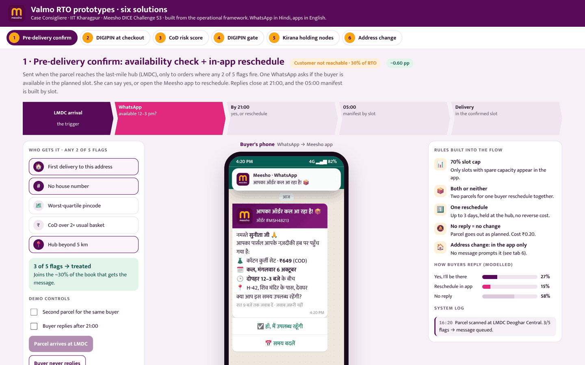
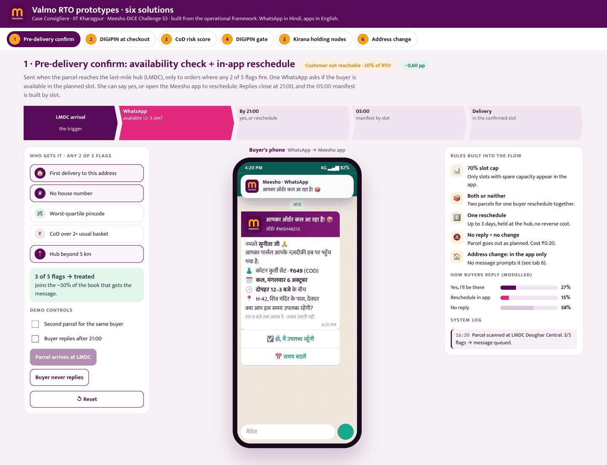
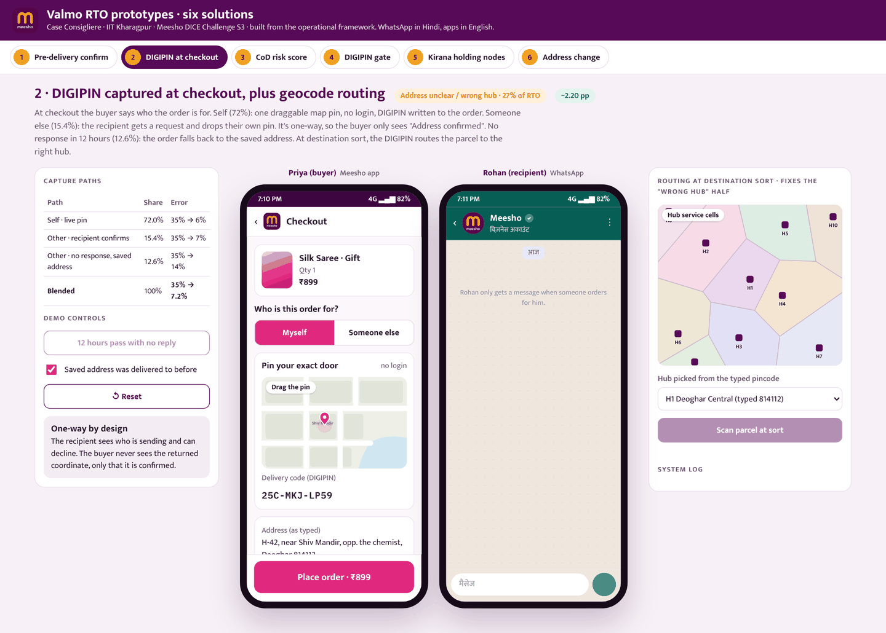
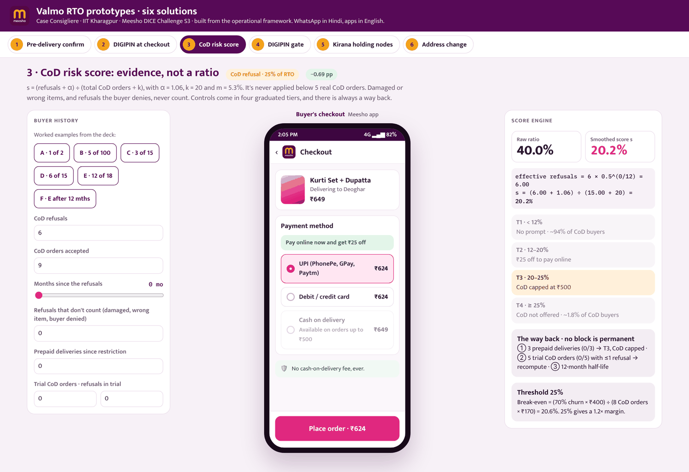
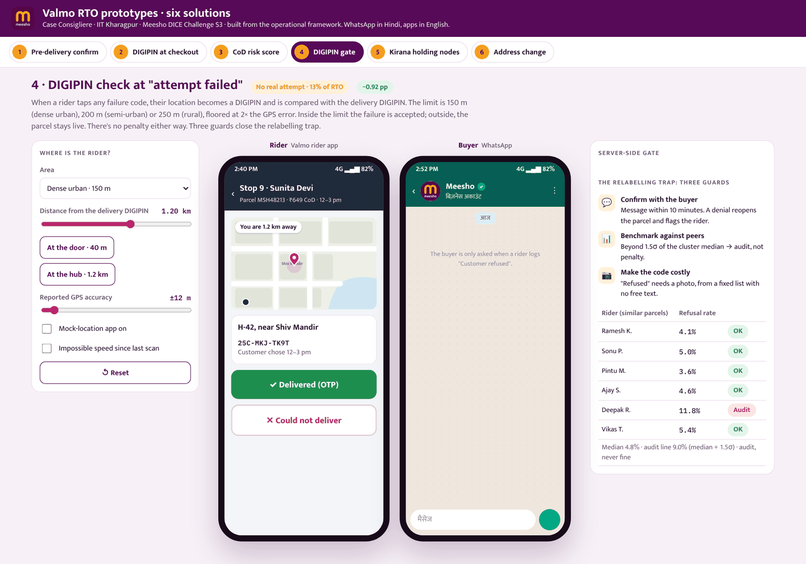
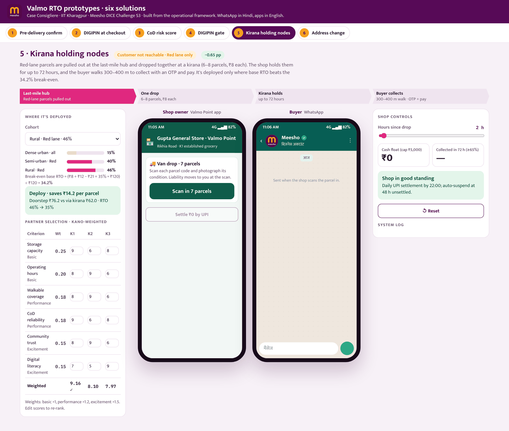
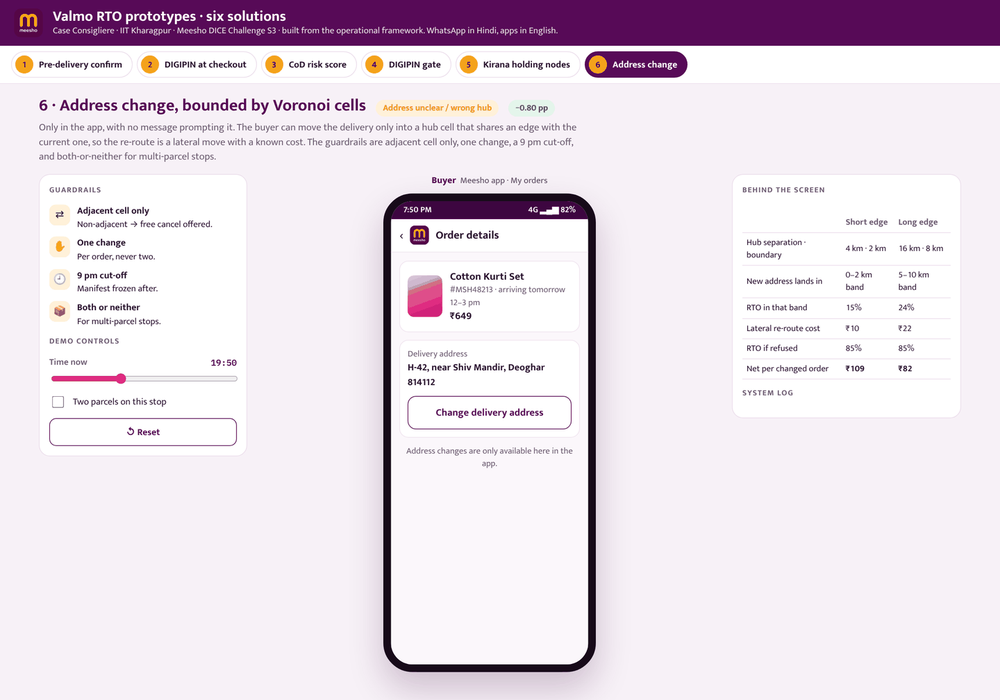

<div align="center">

# Valmo RTO Prototypes

**Six interactive prototypes for cutting return-to-origin (RTO) on Valmo, Meesho's logistics network**

[](https://incredible-cucurucho-909787.netlify.app/)


Team **Case Consigliere** · IIT Kharagpur · Meesho DICE Challenge Season 3 (Business Track)

### ▶ [incredible-cucurucho-909787.netlify.app](https://incredible-cucurucho-909787.netlify.app/)



</div>

---

## About

When a parcel can't be delivered, it travels back to the seller. That return trip is RTO, and the parcel costs money both ways and earns nothing. This project turns our operational framework for Valmo into working prototypes. Each one shows the real screens the buyer, rider or shop owner would see, the rules running behind them, and a live system log.

- **Six solutions, six tabs.** Each fix targets one cause of RTO.
- **Every actor's view.** The buyer's Meesho app, the buyer's WhatsApp (in Hindi), the Valmo rider app and the Valmo Point shop app.
- **Interactive.** Toggle conditions, push the scenario forward and watch the logic decide.
- **Zero setup.** One self-contained `index.html` with no framework, no build and no backend.

## The six solutions

| # | Solution | RTO cause it targets | Modelled impact | What you can try |
|---|----------|----------------------|:---------------:|------------------|
| 1 | **Pre-delivery confirm**: availability check + in-app reschedule | Customer not reachable (30% of RTO) | **−0.60 pp** | Toggle the 2-of-5 risk flags, send the Hindi WhatsApp, reschedule into a slot with spare capacity, test late or no replies |
| 2 | **DIGIPIN at checkout**, plus geocode routing | Address unclear / wrong hub (27%) | **−2.20 pp** | Drop a pin for yourself, or send a pin request to a gift recipient; run the 12-hour fallback; route a parcel at destination sort |
| 3 | **CoD risk score**: evidence, not a ratio | CoD refusal (25%) | **−0.69 pp** | Edit a buyer's history and watch the smoothed score move them across four tiers, including the way back |
| 4 | **DIGIPIN gate** at "attempt failed" | No real attempt (13%) | **−0.92 pp** | Move the rider, change area type and GPS accuracy, trip the mock-location and impossible-speed guards |
| 5 | **Kirana holding nodes** | Customer not reachable (Red lane only) | **−0.65 pp** | Pick a cohort against the 34.2% break-even, re-rank partner shops with KANO weights, run the 72-hour shop clock |
| 6 | **Address change**, bounded by Voronoi cells | Address unclear / wrong hub | **−0.80 pp** | Move a delivery into an adjacent hub cell and hit each guardrail (one change, 9 pm cut-off, both-or-neither) |

> Impacts are modelled estimates in percentage points of blended RTO, taken from the team's operational framework. The levers overlap, so the numbers are not meant to be added up. The full rules, formulas and thresholds are in **[docs/SOLUTIONS.md](docs/SOLUTIONS.md)**.

## Screenshots

| | |
|:--:|:--:|
| <br>**1 · Pre-delivery confirm** | <br>**2 · DIGIPIN at checkout** |
| <br>**3 · CoD risk score** | <br>**4 · DIGIPIN gate** |
| <br>**5 · Kirana holding nodes** | <br>**6 · Address change** |

## How to use the demo

1. Open the [live demo](https://incredible-cucurucho-909787.netlify.app/) and pick a solution from the tabs at the top.
2. **Left panel:** the context and the **Demo controls**. Toggle conditions and press the action buttons to move the scenario forward.
3. **Centre:** the phone screens. Tap the buttons inside them as a real user would.
4. **Right panel:** the rules behind the flow, the modelled numbers and a **System log** that explains each decision.
5. Press **↺ Reset** to start a tab again.

WhatsApp messages are in Hindi; the apps are in English. All orders, people, places and numbers are simulated.

## Run it locally

No install is needed. Clone the repo and open `index.html` in a browser:

```bash
git clone https://github.com/alokaaaa/Meesho-Prototype.git
cd Meesho-Prototype
open index.html            # macOS; on Windows use: start index.html
```

Or serve it on a local port:

```bash
python3 -m http.server 8000
# then visit http://localhost:8000
```

## Deployment

The site is live on **Netlify**: <https://incredible-cucurucho-909787.netlify.app/>

To redeploy, use either option:

- **Netlify Drop:** drag the project folder onto [app.netlify.com/drop](https://app.netlify.com/drop), or onto the Deploys tab of the existing site.
- **Git-connected:** in Netlify, choose *Add new site → Import an existing project* and pick this repo. `netlify.toml` already sets the publish directory to the repo root with no build command, so every push to `main` redeploys.

**GitHub Pages** works too: *Settings → Pages → Deploy from a branch → `main` / `(root)`*.

## Tech notes

- **Single file:** HTML, CSS and vanilla JavaScript in one `index.html` (~136 KB). It has no dependencies to install and makes no network calls apart from web fonts.
- **DIGIPIN:** an in-browser encoder that follows India Post's open DIGIPIN specification (a 10-character code for a roughly 4 m × 4 m cell).
- **Voronoi hub cells:** built with [d3-delaunay](https://github.com/d3/d3-delaunay), inlined so the page works on its own.
- **Distances:** haversine distance between the rider's DIGIPIN and the delivery DIGIPIN.
- **Fonts:** [Mukta](https://fonts.google.com/specimen/Mukta) (Latin + Devanagari) and [IBM Plex Mono](https://fonts.google.com/specimen/IBM+Plex+Mono) from Google Fonts. The page falls back to system fonts offline.
- **Responsive:** the three-column layout stacks on smaller screens.

## Project structure

```
valmo-rto-prototypes/
├── index.html              # the whole prototype (HTML + CSS + JS)
├── netlify.toml            # Netlify config: publish root, no build
├── docs/
│   ├── SOLUTIONS.md        # rules, formulas and thresholds for each solution
│   └── screenshots/        # images used in this README
├── LICENSE
├── .gitignore
└── README.md
```

## Team

**Case Consigliere**, IIT Kharagpur

- Adrij Bhattacharya
- Sayan Dutta
- Alok Anand

## Disclaimer

This is a student prototype made for the Meesho DICE Challenge Season 3. It is not an official Meesho or Valmo product. The Meesho and Valmo names and the Meesho logo belong to their owners and appear only to show how the proposed flows would look. All data is simulated, and the impact figures are modelled estimates, not measured results.

## License

The code is released under the [MIT License](LICENSE). The Meesho and Valmo names and logos are not covered by it.
